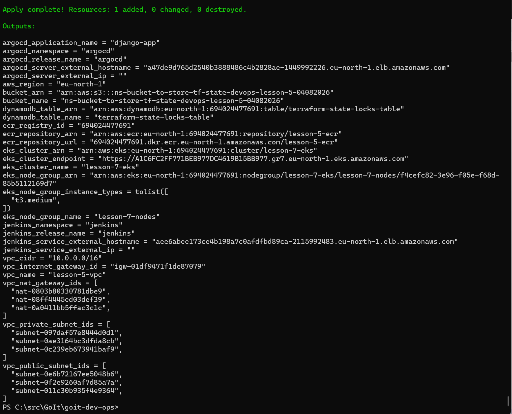
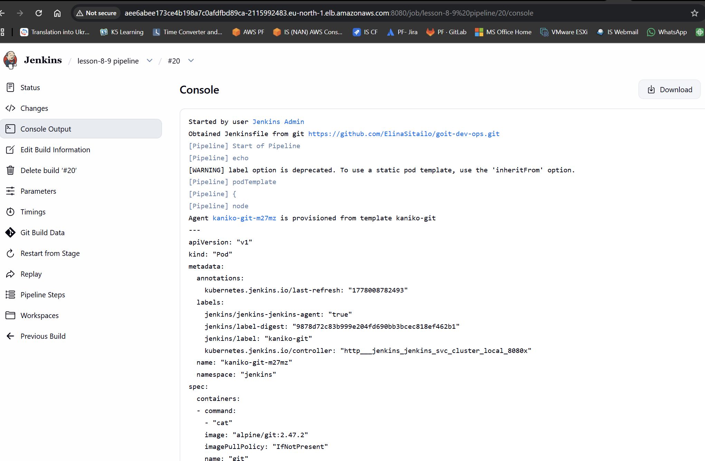
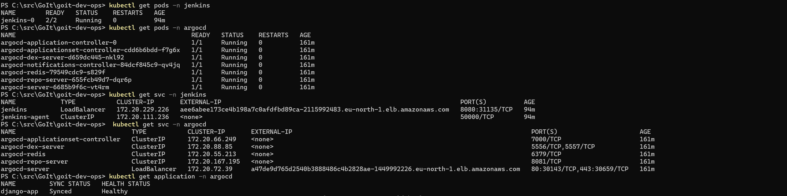
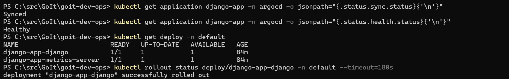
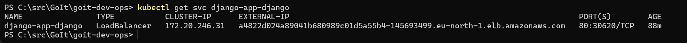
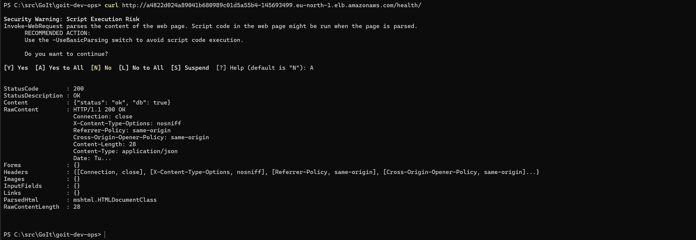

# Infrastructure & Deployment Architecture

This project provisions a complete AWS cloud infrastructure and GitOps CI/CD pipeline that takes a Django application from a Git push all the way to a running Kubernetes deployment — fully automated.

---

## Table of Contents

1. [What This Project Does](#1-what-this-project-does)
2. [High-Level Architecture](#2-high-level-architecture)
3. [End-to-End Deployment Flow](#3-end-to-end-deployment-flow)
4. [Infrastructure Components](#4-infrastructure-components)
   - [Remote State (S3 + DynamoDB)](#41-remote-state-s3--dynamodb)
   - [Networking (VPC)](#42-networking-vpc)
   - [Container Registry (ECR)](#43-container-registry-ecr)
   - [Kubernetes Cluster (EKS)](#44-kubernetes-cluster-eks)
   - [CI Server (Jenkins)](#45-ci-server-jenkins)
   - [GitOps Controller (Argo CD)](#46-gitops-controller-argo-cd)
5. [CI/CD Pipeline Detail](#5-cicd-pipeline-detail)
6. [Application (Django)](#6-application-django)
7. [Terraform Module Tree](#7-terraform-module-tree)
8. [Key Variables Reference](#8-key-variables-reference)
9. [First-Time Setup](#9-first-time-setup)
10. [Smoke Tests](#10-smoke-tests)
11. [Tear Down](#11-tear-down)

---

## 1. What This Project Does

| Goal | How |
|------|-----|
| Provision repeatable AWS infrastructure | Terraform modules (`vpc`, `ecr`, `eks`, `jenkins`, `argo_cd`) |
| Store Terraform state safely | S3 bucket + DynamoDB lock table (bootstrapped first) |
| Build Docker images without a Docker daemon | Kaniko running inside a Kubernetes Jenkins agent |
| Push built images to a private registry | AWS ECR (`lesson-5-ecr`) |
| Deploy the app declaratively from Git | Argo CD watching a Helm chart in the GitOps repo |
| Auto-heal and auto-prune Kubernetes state | Argo CD `selfHeal: true`, `prune: true` sync policy |
| Scale the app under load | Kubernetes HPA (1–6 replicas, CPU-based) |

**Region**: `eu-north-1` (Stockholm)

---

## 2. High-Level Architecture

```
┌─────────────────────────────────────────────────────────────┐
│  Developer Machine                                          │
│   git push  →  goit-dev-ops repo (lesson-8-9)              │
└────────────────────────┬────────────────────────────────────┘
                         │ SCM trigger
                         ▼
┌─────────────────────────────────────────────────────────────┐
│  Jenkins  (EKS pod, kaniko-git template)                    │
│   1. Clone source into /workspace/src (git container)       │
│   2. Write ECR config.json to /workspace/.docker            │
│   3. Build image with Kaniko from /workspace/src/app        │
│   4. Push to ECR  (tag: <build>-<sha>  +  latest)          │
│   5. Clone repo, sed-update values.yaml, git push           │
└────────────────────────┬────────────────────────────────────┘
                         │ Git commit detected
                         ▼
┌─────────────────────────────────────────────────────────────┐
│  Argo CD  (EKS pod)                                         │
│   Watches: goit-dev-ops  branch: lesson-8-9                 │
│            path: charts/django-app                          │
│   Auto-sync  →  runs Helm  →  applies to default namespace  │
└────────────────────────┬────────────────────────────────────┘
                         │ Rolling update
                         ▼
┌─────────────────────────────────────────────────────────────┐
│  EKS Cluster  (lesson-7-eks)                                │
│  ┌───────────────────────────────────────────────────────┐  │
│  │  default namespace                                    │  │
│  │  django-app  Deployment  (HPA: 1–6 replicas)         │  │
│  │  LoadBalancer  Service  →  public DNS hostname        │  │
│  └───────────────────────────────────────────────────────┘  │
│  ┌─────────────┐   ┌─────────────┐                         │
│  │  jenkins ns │   │  argocd ns  │                         │
│  └─────────────┘   └─────────────┘                         │
└─────────────────────────────────────────────────────────────┘
         ▲ image pull
         │
┌────────┴──────────┐
│  ECR              │
│  lesson-5-ecr     │
│  lifecycle: keep  │
│  last 10 tags     │
└───────────────────┘
```

---

## 3. End-to-End Deployment Flow

### Step 1 — Developer pushes code

A developer pushes a commit to the `lesson-8-9` branch of the application repository (`goit-dev-ops`).

### Step 2 — Jenkins detects the change

Jenkins polls SCM. When a new commit is found it schedules a build and allocates a Kubernetes pod agent with four containers: `kaniko`, `git`, `yq`, and `aws-cli`. All containers share one `/workspace` `emptyDir` volume, which is the handoff point between stages.

### Step 3 — Checkout and tag calculation

The `Checkout Source` stage runs in the `git` container and clones the source repo directly into `/workspace/src` (the shared volume). It then computes a unique, traceable image tag:

```
IMAGE_TAG = "<BUILD_NUMBER>-<7-char-git-sha>"
# e.g.  20-3122f83
```

Cloning into `/workspace/src` ensures kaniko can read the source — the jnlp agent's workspace path (`/home/jenkins/agent/...`) is not mounted in the kaniko container.

### Step 4 — ECR authentication

The `ECR Auth` stage (runs in the `aws-cli` container):
1. Calls `aws ecr get-login-password` using the `aws-jenkins` credential.
2. Base64-encodes `AWS:<token>`.
3. Writes `/workspace/.docker/config.json` on the shared volume so Kaniko can read it without mounting `/var/run/docker.sock`.

### Step 5 — Build and push with Kaniko

The `Build and Push to ECR` stage (runs in the `kaniko` container):
```
cp /workspace/.docker/config.json /kaniko/.docker/config.json

/kaniko/executor \
  --context      /workspace/src/app \
  --dockerfile   /workspace/src/app/Dockerfile \
  --destination  <ecr_url>:<IMAGE_TAG> \
  --destination  <ecr_url>:latest
```
Kaniko reads credentials from `/kaniko/.docker/config.json` (its default lookup path). It builds the image layer by layer without a Docker daemon (rootless) and pushes two tags: the versioned tag and `latest`.

### Step 6 — Update the GitOps repo

The `Update Helm values in GitOps repo` stage (runs in the `git` container):
1. Clones the GitOps repository (`GITOPS_REPO_URL`, same repo as source) using the `gitops-repo-token` credential into `/workspace/gitops-repo`.
2. Updates the `image.tag` field in `charts/django-app/values.yaml` using `sed`:
   ```sh
   sed -i "s|^  tag:.*|  tag: \"<IMAGE_TAG>\"|" charts/django-app/values.yaml
   ```
3. Commits as `jenkins-bot` with message `ci: update django image tag to <IMAGE_TAG>`.
4. Pushes to the configured `GITOPS_BRANCH`.

### Step 7 — Argo CD detects the GitOps commit

Argo CD continuously polls the GitOps repository. It detects the new commit in `charts/django-app/` and marks the application as `OutOfSync`.

### Step 8 — Argo CD syncs to the cluster

Because `syncPolicy.automated` is enabled, Argo CD immediately:
1. Runs `helm template` with the updated `values.yaml`.
2. Applies the resulting manifests to the `default` namespace.
3. The `Deployment` resource gets a new `image:` value, triggering a Kubernetes rolling update.
4. **prune: true** — removes any Kubernetes resources that were deleted from the chart.
5. **selfHeal: true** — re-applies if any resource drifts from the Git state.

### Step 9 — New pods become ready

Kubernetes pulls the new image from ECR, creates new pods (max 1 unavailable during rollout), waits for readiness probes to pass, then terminates old pods.

### Step 10 — Traffic served

The `django-app` `LoadBalancer` Service exposes the application on a public AWS ELB hostname. The health check endpoint is available at `http://<hostname>/health/`.

---

## 4. Infrastructure Components

### 4.1 Remote State (S3 + DynamoDB)

**Module**: `modules/s3-backend`  
**Must be bootstrapped before any other `terraform apply`.**

| Resource | Name | Purpose |
|----------|------|---------|
| `aws_s3_bucket` | `ns-bucket-to-store-tf-state-devops-lesson-5-04082026` | Stores `terraform.tfstate` |
| `aws_s3_bucket_versioning` | — | Keeps history of every state revision |
| `aws_s3_bucket_server_side_encryption_configuration` | AES256 | Encrypts state at rest |
| `aws_s3_bucket_public_access_block` | All blocked | Prevents accidental public exposure |
| `aws_s3_bucket_lifecycle_configuration` | — | Moves old versions to `STANDARD_IA` after 30 days, expires after 90 days |
| `aws_dynamodb_table` | `terraform-state-locks-table` | Prevents concurrent `apply` runs (advisory lock) |

The S3 bucket is imported into state on first use because Terraform cannot create the backend bucket using itself:
```
terraform import module.s3_backend.aws_s3_bucket.terraform_state <bucket-name>
```

---

### 4.2 Networking (VPC)

**Module**: `modules/vpc`

Creates an isolated network in `eu-north-1` spread across three Availability Zones.

```
VPC  10.0.0.0/16
├── Public subnets (3×/24 — one per AZ)
│   ├── 10.0.1.0/24  eu-north-1a
│   ├── 10.0.2.0/24  eu-north-1b
│   └── 10.0.3.0/24  eu-north-1c
│   └── → Internet Gateway (IGW)
│       Tagged: kubernetes.io/role/elb=1  (AWS LoadBalancer discovery)
│
└── Private subnets (3×/24 — one per AZ)
    ├── 10.0.4.0/24  eu-north-1a
    ├── 10.0.5.0/24  eu-north-1b
    └── 10.0.6.0/24  eu-north-1c
    └── → NAT Gateways (one per AZ, backed by Elastic IPs)
        Tagged: kubernetes.io/role/internal-elb=1
```

EKS worker nodes run in **private** subnets. Load Balancers are placed in **public** subnets. Each private subnet routes outbound internet traffic through its own NAT Gateway (no cross-AZ NAT cost).

---

### 4.3 Container Registry (ECR)

**Module**: `modules/ecr`  
**Repository name**: `lesson-5-ecr`

| Setting | Value | Reason |
|---------|-------|--------|
| Tag mutability | `MUTABLE` | Allows overwriting `latest` tag |
| Scan on push | `true` | Automatic vulnerability scanning on every push |
| Encryption | AES256 | Images encrypted at rest |
| Force delete | `true` | Allows `terraform destroy` even when images exist (dev) |
| Lifecycle — tagged images | Keep latest 10 | Prevents unbounded storage growth |
| Lifecycle — untagged images | Delete after 14 days | Cleans up build cache layers |

Access policy grants full read/write to the current AWS account only.

---

### 4.4 Kubernetes Cluster (EKS)

**Module**: `modules/eks`  
**Cluster name**: `lesson-7-eks`  **Version**: `1.32`

**Control plane**
- IAM role with `AmazonEKSClusterPolicy` + `AmazonEKSVPCResourceController`
- API endpoint: public + private (public for dev convenience)
- Audit and API logs enabled in CloudWatch

**Node group** (`lesson-7-nodes`)

| Setting | Value |
|---------|-------|
| Instance type | `t3.medium` |
| Desired / Min / Max | 2 / 1 / 4 |
| Disk | 20 GB gp3 |
| Placement | Private subnets |
| Max unavailable during update | 1 (rolling) |
| `ignore_changes = [desired_size]` | Allows HPA/autoscaler to manage count |

**Node IAM role** has:
- `AmazonEKSWorkerNodePolicy`
- `AmazonEKS_CNI_Policy` (for the VPC CNI plugin)
- `AmazonEC2ContainerRegistryReadOnly` (pull images from ECR without credentials)

**Security groups**:
- Control plane SG: accepts port 443 from node SG only
- Node SG: accepts all node-to-node traffic + ports 1025–65535 from control plane

---

### 4.5 CI Server (Jenkins)

**Module**: `modules/jenkins`  
**Helm chart**: `jenkins@5.9.18`  
**Namespace**: `jenkins`

Jenkins is deployed with **Configuration as Code (JCasC)** — no manual UI setup is needed.

**What JCasC configures automatically:**

1. **Kubernetes cloud** — Jenkins schedules ephemeral build pods on the same EKS cluster. Each pod is discarded after the build finishes.

2. **Pod template `kaniko-git`** — every pipeline build gets a pod with four containers, all sharing a single `/workspace` `emptyDir` volume:

   | Container | Image | Purpose |
   |-----------|-------|---------|
   | `kaniko` | `gcr.io/kaniko-project/executor:v1.23.2-debug` | Build Docker image (rootless) |
   | `git` | `alpine/git:2.47.2` | Clone source repo, update values.yaml, push |
   | `yq` | `mikefarah/yq:4.44.3` | Declared in Jenkinsfile pod spec (unused at runtime — `git`+`sed` used instead) |
   | `aws-cli` | `amazon/aws-cli:2.22.35` | ECR authentication |

   The `jnlp` sidecar (Jenkins remoting agent) mounts `/home/jenkins/agent`; all other containers mount `/workspace`. Stages pass artefacts between containers via `/workspace`.

3. **Credentials pre-seeded:**
   - `aws-jenkins` — AWS access key + secret (type: AWS Credentials)
   - `gitops-repo-token` — GitHub username + PAT for pushing to the GitOps repo

**Plugins installed**: `kubernetes`, `workflow-aggregator`, `git`, `configuration-as-code`, `credentials-binding`, `aws-credentials`

**Storage**: 8 Gi persistent volume for Jenkins home

Access: `LoadBalancer` Service — `terraform output jenkins_service_external_hostname`

---

### 4.6 GitOps Controller (Argo CD)

**Module**: `modules/argo_cd`  
**Helm chart**: `argo-cd@7.8.23`  
**Namespace**: `argocd`

Two Helm releases are created:

1. **`argocd`** — installs the Argo CD server, application controller, repo server, and Redis.
2. **`django-app-apps`** — uses `argocd-apps@2.0.2` to declare the `Application` resource.

**Application configuration:**

| Field | Value |
|-------|-------|
| `repoURL` | `TF_VAR_argocd_application_repo_url` |
| `targetRevision` | `lesson-8-9` |
| `path` | `charts/django-app` |
| `destination.namespace` | `default` |
| `syncPolicy.automated.prune` | `true` |
| `syncPolicy.automated.selfHeal` | `true` |
| `CreateNamespace=true` | Auto-creates namespace if missing |

Secrets (`DATABASE_PASSWORD`, `DJANGO_SECRET_KEY`, `ALLOWED_HOSTS`) are injected as Helm values directly from Terraform variables — Argo CD passes them through to the Helm chart at sync time.

Access: `LoadBalancer` Service — `terraform output argocd_server_external_hostname`

---

## 5. CI/CD Pipeline Detail

**File**: [Jenkinsfile](Jenkinsfile)

```
Stage 1: Checkout Source  (git container)
  └─ git clone <source-repo> /workspace/src
  └─ IMAGE_TAG = "${BUILD_NUMBER}-${git -C /workspace/src rev-parse --short=7 HEAD}"

Stage 2: ECR Auth  (aws-cli container)
  └─ aws ecr get-login-password → base64 → /workspace/.docker/config.json

Stage 3: Build and Push to ECR  (kaniko container)
  └─ cp /workspace/.docker/config.json /kaniko/.docker/config.json
  └─ /kaniko/executor --context /workspace/src/app
                      --dockerfile /workspace/src/app/Dockerfile
                      --destination <ecr>:<IMAGE_TAG>
                      --destination <ecr>:latest

Stage 4: Update Helm values in GitOps repo  (git container)
  └─ git clone <gitops-repo> /workspace/gitops-repo
  └─ sed -i "s|^  tag:.*|  tag: \"<IMAGE_TAG>\"|" charts/django-app/values.yaml
  └─ git commit "ci: update django image tag to <IMAGE_TAG>"
  └─ git push origin <GITOPS_BRANCH>
```

**Pipeline options**:
- `disableConcurrentBuilds()` — prevents image tag collisions

---

## 6. Application (Django)

**Source**: `app/`  **Helm chart**: `charts/django-app/`

The Helm chart deploys the following Kubernetes resources:

| Resource | Details |
|----------|---------|
| `Deployment` | Rolling update strategy; image pulled from ECR |
| `Service` | `LoadBalancer` type; exposes port 80 publicly |
| `ConfigMap` | Non-secret environment variables (e.g. `ALLOWED_HOSTS`) |
| `Secret` | `DATABASE_PASSWORD`, `DJANGO_SECRET_KEY` |
| `HorizontalPodAutoscaler` | CPU-based scaling, min 1 / max 6 replicas |

Health check endpoint: `GET /health/` — used by Kubernetes liveness and readiness probes.

---

## 7. Terraform Module Tree

```
goit-dev-ops/
├── terraform.tf          # Provider config, S3 backend
├── variables.tf          # All root input variables
├── main.tf               # Module instantiation
├── outputs.tf            # Exported values (URLs, IDs)
│
└── modules/
    ├── s3-backend/       # S3 bucket + DynamoDB lock table
    ├── vpc/              # VPC, subnets, IGW, NAT gateways, route tables
    ├── ecr/              # ECR repository + lifecycle policy + IAM policy
    ├── eks/              # EKS cluster, node group, IAM roles, security groups
    ├── jenkins/          # Jenkins Helm release, JCasC, K8s cloud, credentials
    └── argo_cd/          # Argo CD Helm release + Application resource
```

---

## 8. Key Variables Reference

Set these before running `terraform apply` (see `env.ps1.example`):

| Variable | Description |
|----------|-------------|
| `AWS_ACCESS_KEY_ID` / `AWS_SECRET_ACCESS_KEY` | AWS credentials for Terraform |
| `TF_VAR_database_password` | Django database password |
| `TF_VAR_django_secret_key` | Django `SECRET_KEY` |
| `TF_VAR_django_allowed_hosts` | Django `ALLOWED_HOSTS` (e.g. `*` for dev) |
| `TF_VAR_jenkins_admin_password` | Jenkins admin UI password |
| `TF_VAR_jenkins_gitops_username` | GitHub username for GitOps pushes |
| `TF_VAR_jenkins_gitops_token` | GitHub PAT for GitOps pushes |
| `TF_VAR_argocd_application_repo_url` | Git URL Argo CD watches |
| `TF_VAR_argocd_application_target_revision` | Branch Argo CD tracks (default `main`) |
| `TF_VAR_argocd_application_path` | Path to Helm chart inside GitOps repo |

---

## 9. First-Time Setup

```powershell
# 1. Install Terraform CLI (>= 1.2)

# 2. Create the S3 state bucket manually in the AWS console
#    Name: ns-bucket-to-store-tf-state-devops-lesson-5-04082026

# 3. Import the bucket into Terraform state
terraform import module.s3_backend.aws_s3_bucket.terraform_state `
  ns-bucket-to-store-tf-state-devops-lesson-5-04082026

# 4. Copy the env template and fill in your secrets
cp env.ps1.example env.ps1
# edit env.ps1 with your values

# 5. Load environment variables
. .\env.ps1

# 6. Run the full deployment
.\deploy.ps1
```

`deploy.ps1` will:
- Validate all required env vars are set
- Run `terraform apply -auto-approve`
- Update `~/.kube/config` for `kubectl` access
- Poll until Jenkins and Argo CD LoadBalancer hostnames are available
- Print a summary with all URLs

**Verify the Django app:**
```powershell
kubectl get svc django-app-django
curl http://<EXTERNAL-IP>/health/
```

---

## 10. Smoke Tests

Run these commands after `deploy.ps1` completes to confirm every layer is healthy.

### Infrastructure

```powershell
# Nodes are Ready
kubectl get nodes

# EBS CSI driver addon is ACTIVE
aws eks describe-addon --cluster-name lesson-7-eks --addon-name aws-ebs-csi-driver `
  --region eu-north-1 --query "addon.status"
```

### Jenkins

```powershell
# Get the Jenkins URL
terraform output -raw jenkins_service_external_hostname

# Pod is Running
kubectl get pods -n jenkins

# Persistent volume is Bound (Jenkins home survives restarts)
kubectl get pvc -n jenkins
```

Open `http://<jenkins-hostname>` in a browser and log in with the admin credentials from `env.ps1`.

### Argo CD

```powershell
# Get the Argo CD URL
terraform output -raw argocd_server_external_hostname

# Pod is Running
kubectl get pods -n argocd

# Application is Synced and Healthy
kubectl get applications -n argocd
```

Open `http://<argocd-hostname>` in a browser. The `django-app` application should show **Synced / Healthy**.

### Django application

```powershell
# All pods Running (django + postgresql + metrics-server)
kubectl get pods -n default

# LoadBalancer has an external hostname
kubectl get svc django-app-django -n default

# Health endpoint returns {"status": "ok", "db": true}
$HOST = kubectl get svc django-app-django -n default `
  -o jsonpath='{.status.loadBalancer.ingress[0].hostname}'
curl "http://$HOST/health/"
```

### CI/CD round-trip

```powershell
# Trigger a Jenkins build (or push a commit) then verify:

# 1. New image tag appears in ECR
aws ecr describe-images --repository-name lesson-5-ecr --region eu-north-1 `
  --query 'sort_by(imageDetails, &imagePushedAt)[-3:].imageTags'

# 2. values.yaml tag was updated by jenkins-bot
git log --oneline -5 -- charts/django-app/values.yaml

# 3. Argo CD rolled out the new image
kubectl rollout status deployment/django-app-django -n default

# 4. Health check still passes after rollout
curl "http://$HOST/health/"
```

### terraform apply result

### happy jenkins job

### smoke test result 1

### smoke test result 2

### smoke test result 3

### smoke test result 4



---

## 11. Tear Down

```powershell
# Destroy all cloud resources
terraform destroy -auto-approve

# Manually delete the S3 bucket (Terraform cannot destroy it because force_destroy=false)
# Go to AWS Console → S3 → Empty bucket → Delete bucket
```

> The S3 bucket has `force_destroy = false` intentionally — this prevents accidentally deleting historical state files.
