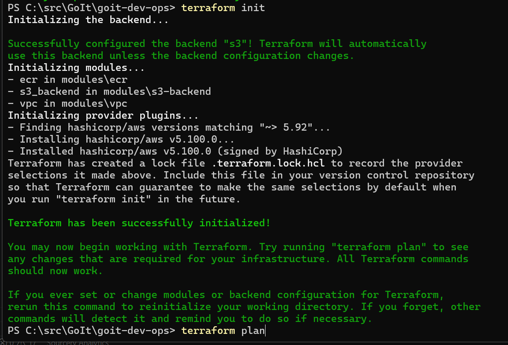
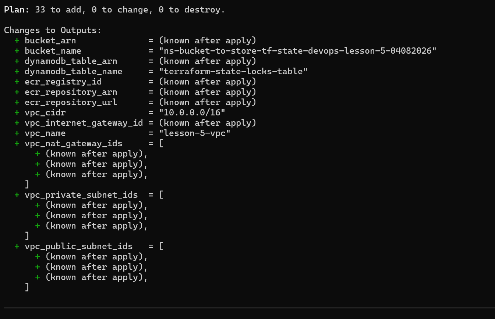
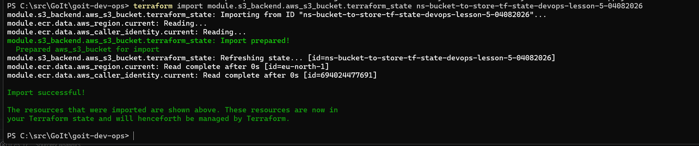
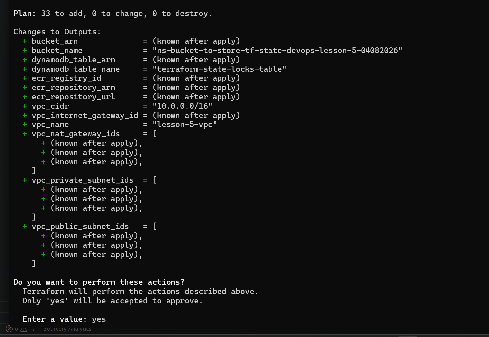
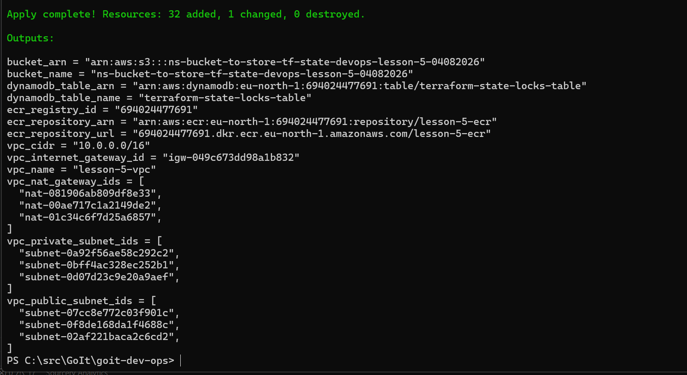
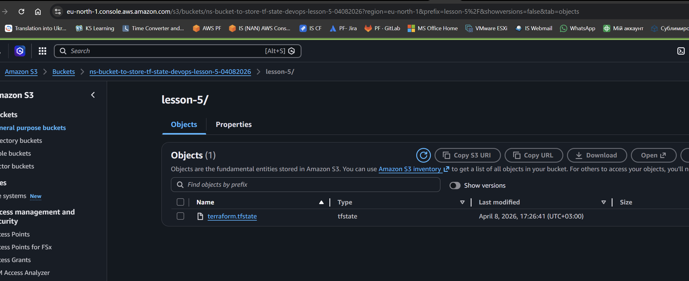
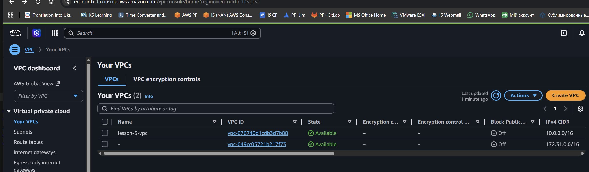
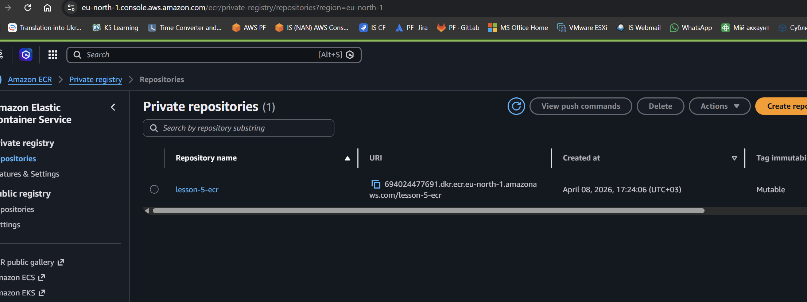
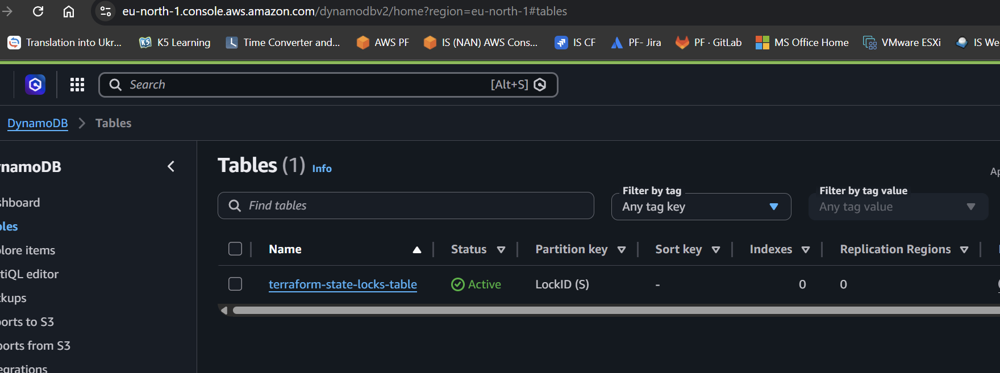

# Project structure

- 📄README.md                - Project documentation
- 📄main.tf                  - Main file with modules setup
- 📄backend.tf               - Backend setup (S3 + DynamoDB)
- 📄outputs.tf               - Main outputs
- 📁 modules                 - Directory with modules
    - 📁 s3-backend          - S3 && DynamoDB module
        - 📄s3.tf            - S3-bucket setup
        - 📄dynamodb.tf      - DynamoDB setup
        - 📄variables.tf     - S3 variables
        - 📄outputs.tf       - S3 && DynamoDB outputs
    - 📁 vpc                 - VPC module
        - 📄vpc.tf           - Create VPC, subnets, Internet Gateway
        - 📄routes.tf        - Routing setup
        - 📄variables.tf     - VPC variables
        - 📄outputs.tf       - VPC outputs
    - 📁 ecr                 - ECR module
        - 📄ecr.tf           - ECR repo creation
        - 📄variables.tf     - ECR variables
        - 📄outputs.tf       - ECR outputs

## Commands to init and run infrastructure

1. obtain AWS credentials to deploy resources from project
2. install terraform cli on local environment
    - windows:
        - https://stackoverflow.com/questions/66167230/message-while-installing-chocolatey
        - https://developer.hashicorp.com/terraform/install

3. set AWS cred to use by terraform
    - windows powershell, run:
        - 🔧 $env:AWS_ACCESS_KEY_ID="your_access_key"
        - 🔧 $env:AWS_SECRET_ACCESS_KEY="your_secret_key"
4. create s3 bucket in AWS console, use name from variables.tf "ns-bucket-to-store-tf-state-devops-lesson-5-04082026"
5. run terraform commands
    - 🔧 `terraform init`
    - 🔧 `terraform plan`
    - 🔧 `terraform import module.s3_backend.aws_s3_bucket.terraform_state ns-bucket-to-store-tf-state-devops-lesson-5-04082026`
    - 🔧 `terraform apply`
        - check if your infrastructure is available in AWS
            - S3 bucket with lock file
            - ECR
            - VPC
    - 🔧 `terraform destroy` - to delete all created resources with the project
6. Ensure all previously created aws resources are deleted:
    - check 'lesson-5-ecr' ECR is deleted
    - check DynamoDb 'terraform-state-locks-table' is deleted
    - check VPCs state. Expected state is 'Deleted'.
7. You can manually delete 'ns-bucket-to-store-tf-state-devops-lesson-5-04082026' s3 bucket

## Screenshots

### 1. Terraform Init

### 2. Terraform Plan

### 3. Import S3 Bucket

### 4. Terraform Apply

### 5. Terraform Apply Complete

### S3 Buckets

### VPCs

### ECR

### DynamoDb Table

