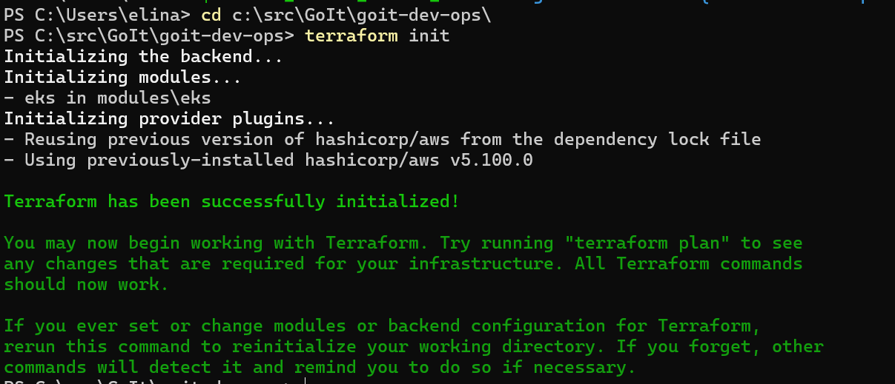
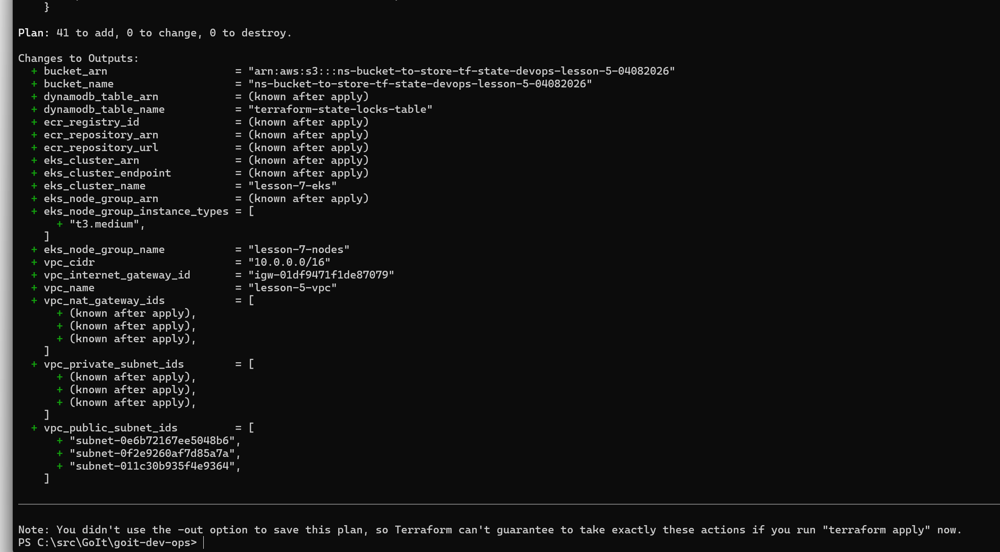
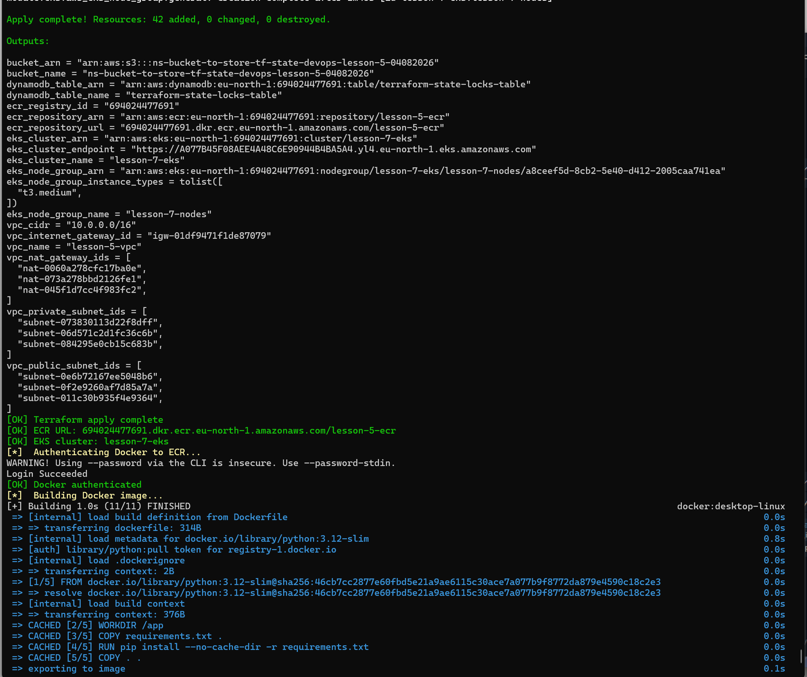
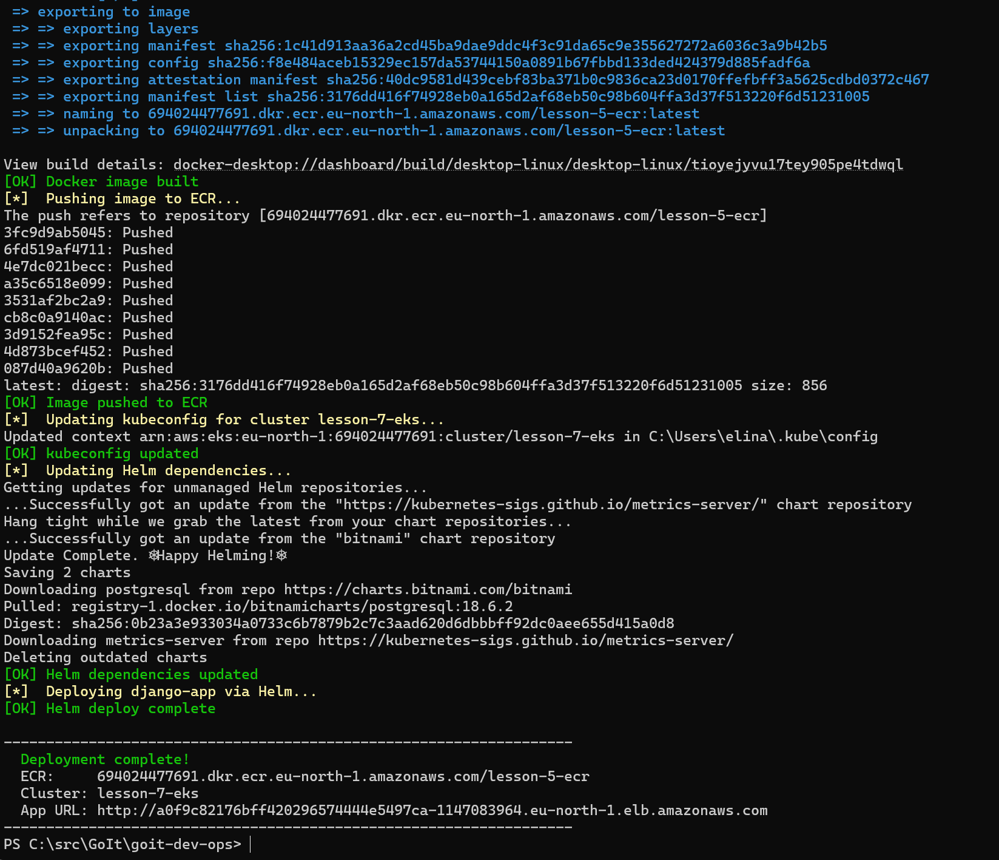
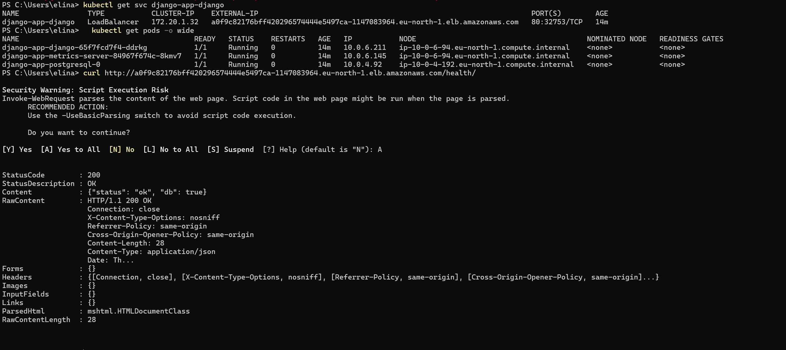

# Project structure

- 📄 README.md                     - Project documentation
- 📄 main.tf                       - Main Terraform file with module definitions
- 📄 terraform.tf                  - Terraform backend (S3 + DynamoDB) and provider config
- 📄 variables.tf                  - Root variables (AWS, VPC, ECR, EKS, app secrets)
- 📄 outputs.tf                    - Root outputs (S3, DynamoDB, VPC, ECR, EKS)
- 📄 Jenkinsfile                   - Jenkins pipeline (Kaniko + Git) for build/push/update-values flow
- 📄 deploy.ps1                    - Full deployment script (Terraform → Docker → ECR → Helm)
- 📄 env.ps1.example               - Template for local secrets (copy to env.ps1, never commit)
- 📄 .env.example                  - Template for Linux/WSL secrets (copy to .env, never commit)
- 📁 app/                          - Django application source code
    - 📄 Dockerfile                - Docker image definition
    - 📄 requirements.txt          - Python dependencies
    - 📄 manage.py                 - Django management script
    - 📁 app/                      - Django project package (settings, urls, wsgi)
    - 📁 health/                   - Health check endpoint (/health/)
- 📁 charts/                       - Helm charts
    - 📁 django-app/               - Helm chart for the Django application
        - 📄 Chart.yaml            - Chart metadata and dependencies (postgresql, metrics-server)
        - 📄 values.yaml           - Default chart values
        - 📁 templates/            - Kubernetes manifest templates
            - 📄 deployment.yaml   - Django app Deployment
            - 📄 service.yaml      - LoadBalancer Service for public access
            - 📄 configmap.yaml    - Environment variables ConfigMap
            - 📄 secret.yaml       - Kubernetes Secret for DATABASE_PASSWORD
            - 📄 hpa.yaml          - HorizontalPodAutoscaler (CPU-based, 1-6 replicas)
- 📁 modules/                      - Terraform modules
    - 📁 s3-backend/               - S3 bucket + DynamoDB for Terraform state
        - 📄 s3.tf                 - S3 bucket with versioning, encryption, lifecycle
        - 📄 dynamodb.tf           - DynamoDB table for state locking
        - 📄 variables.tf          - Module variables
        - 📄 outputs.tf            - Module outputs
    - 📁 vpc/                      - VPC module
        - 📄 vpc.tf                - VPC, subnets, Internet Gateway, NAT Gateways
        - 📄 routes.tf             - Route tables and associations
        - 📄 variables.tf          - Module variables
        - 📄 outputs.tf            - Module outputs
    - 📁 ecr/                      - ECR module
        - 📄 ecr.tf                - ECR repository, lifecycle policy, access policy
        - 📄 variables.tf          - Module variables
        - 📄 outputs.tf            - Module outputs
    - 📁 eks/                      - EKS module
        - 📄 eks.tf                - EKS cluster, node group, IAM roles, security groups, launch template
        - 📄 variables.tf          - Module variables
        - 📄 outputs.tf            - Module outputs
    - 📁 jenkins/                  - Jenkins module
        - 📄 providers.tf          - Required providers for Helm/Kubernetes resources
        - 📄 variables.tf          - Module variables
        - 📄 jenkins.tf            - Jenkins namespace + Helm release + JCasC Kubernetes cloud
        - 📄 outputs.tf            - Module outputs
    - 📁 argo_cd/                  - Argo CD module
        - 📄 providers.tf          - Required providers for Helm/Kubernetes resources
        - 📄 variables.tf          - Module variables
        - 📄 jenkins.tf            - Argo CD namespace + Helm release + Application resource
        - 📄 outputs.tf            - Module outputs

## Commands to init and run infrastructure

1. obtain AWS credentials to deploy resources from project
2. install terraform cli on local environment
    - windows:
        - https://stackoverflow.com/questions/66167230/message-while-installing-chocolatey
        - https://developer.hashicorp.com/terraform/install
3. Optional commands:
    - 🔧 `terraform init`
    - 🔧 `terraform plan`
4. create s3 bucket in AWS console, use name from variables.tf "ns-bucket-to-store-tf-state-devops-lesson-5-04082026"
5. run the command to use the bucket in terraform
    - 🔧 `terraform import module.s3_backend.aws_s3_bucket.terraform_state ns-bucket-to-store-tf-state-devops-lesson-5-04082026`
6. prepare env.ps1 file using env.ps1.example
7. run
    - 🔧 `. .\env.ps1` - to set environment variables locally
    - 🔧 `.\deploy.ps1` - to run `terraform apply`,
                        build docker image,
                        push image to ECR,
                        deploy django-app via Helm
8. to check deployment result run:
    - 🔧 `kubectl get svc django-app-django`
    - 🔧 `kubectl get pods -o wide`
    - 🔧 `curl http://<App URL from deployment output>/health/`
9. to clear environment run the command below
    - 🔧 `terraform destroy -auto-approve`
10. Manually delete 'ns-bucket-to-store-tf-state-devops-lesson-5-04082026' s3 bucket if needed

## Jenkins + Argo CD workflow

1. Terraform now also installs Jenkins and Argo CD to EKS using Helm provider.
2. Jenkins is configured with Kubernetes cloud and a pod template that contains Kaniko and Git containers.
3. Jenkins pipeline in `Jenkinsfile` implements the flow:
    - build image from `app/Dockerfile`;
    - push image to ECR;
    - update `image.tag` in Helm values file in GitOps repo;
    - push commit to `main`.
4. Argo CD installs an `Application` resource that watches the Git repo/path and auto-syncs changes to the cluster.

### Jenkins credentials required

- `aws-jenkins` (AWS credentials in Jenkins, type: AWS Credentials)
- `gitops-repo-token` (username/password or PAT for target GitOps repository)

### Variables to review before apply

- `argocd_application_repo_url`
- `argocd_application_target_revision`
- `argocd_application_path`
- `argocd_application_destination_namespace`
- `jenkins_admin_password`

## Screenshots

### 1. Terraform Init

### 2. Terraform Plan

### 3. deploy.ps1 output

### 4. app status check

